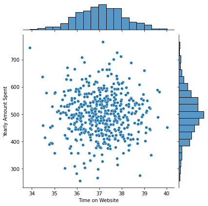
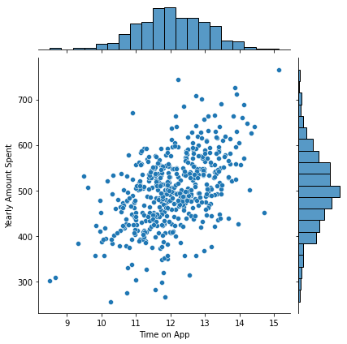
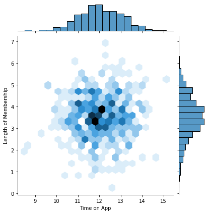
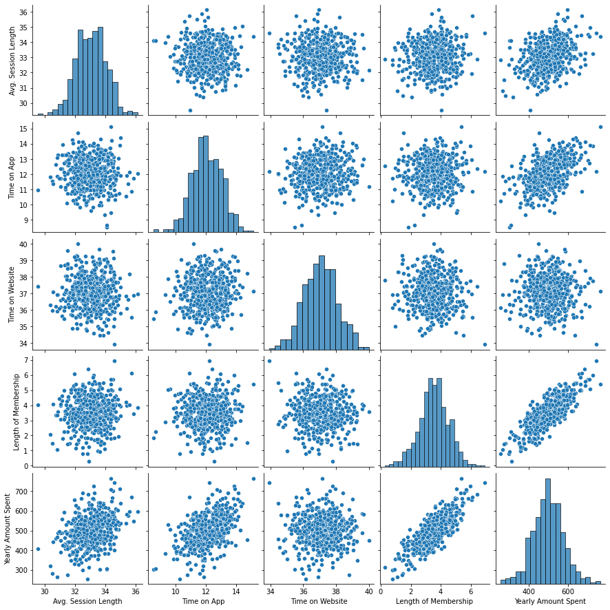
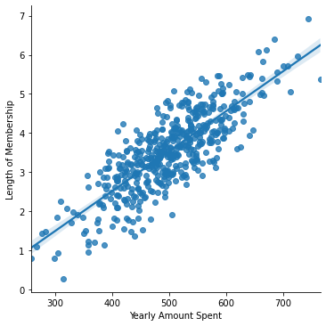
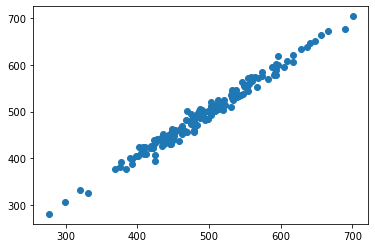
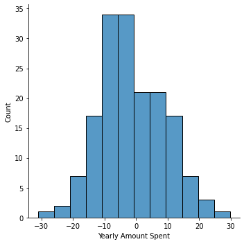

# Linear Regression Project

This is a database for an eommerce company based in New York City that sells clothing online but they also have in-store style and clothing advice sessions. Customers come in to the store, have sessions/meetings with a personal stylist, then they can go home and order either on a mobile app or website for the clothes they want.

The company is trying to decide whether to focus their efforts on their mobile app experience or their website. We are going to figure this out using linear regression machine learning.

<h2>Imports</h2>


```python
import pandas as pd
import numpy as np
import matplotlib.pyplot as plt
import seaborn as sns
%matplotlib inline
```

<h2>Handling Database</h2>


```python
customers = pd.read_csv("Ecommerce Customers")
```


```python
customers.info()
```

    <class 'pandas.core.frame.DataFrame'>
    RangeIndex: 500 entries, 0 to 499
    Data columns (total 8 columns):
     #   Column                Non-Null Count  Dtype  
    ---  ------                --------------  -----  
     0   Email                 500 non-null    object 
     1   Address               500 non-null    object 
     2   Avatar                500 non-null    object 
     3   Avg. Session Length   500 non-null    float64
     4   Time on App           500 non-null    float64
     5   Time on Website       500 non-null    float64
     6   Length of Membership  500 non-null    float64
     7   Yearly Amount Spent   500 non-null    float64
    dtypes: float64(5), object(3)
    memory usage: 31.4+ KB
    


```python
customers.head()
```


<div>
<style scoped>
    .dataframe tbody tr th:only-of-type {
        vertical-align: middle;
    }

    .dataframe tbody tr th {
        vertical-align: top;
    }

    .dataframe thead th {
        text-align: right;
    }
</style>
<table border="1" class="dataframe">
  <thead>
    <tr style="text-align: right;">
      <th></th>
      <th>Email</th>
      <th>Address</th>
      <th>Avatar</th>
      <th>Avg. Session Length</th>
      <th>Time on App</th>
      <th>Time on Website</th>
      <th>Length of Membership</th>
      <th>Yearly Amount Spent</th>
    </tr>
  </thead>
  <tbody>
    <tr>
      <th>0</th>
      <td>mstephenson@fernandez.com</td>
      <td>835 Frank Tunnel\nWrightmouth, MI 82180-9605</td>
      <td>Violet</td>
      <td>34.497268</td>
      <td>12.655651</td>
      <td>39.577668</td>
      <td>4.082621</td>
      <td>587.951054</td>
    </tr>
    <tr>
      <th>1</th>
      <td>hduke@hotmail.com</td>
      <td>4547 Archer Common\nDiazchester, CA 06566-8576</td>
      <td>DarkGreen</td>
      <td>31.926272</td>
      <td>11.109461</td>
      <td>37.268959</td>
      <td>2.664034</td>
      <td>392.204933</td>
    </tr>
    <tr>
      <th>2</th>
      <td>pallen@yahoo.com</td>
      <td>24645 Valerie Unions Suite 582\nCobbborough, D...</td>
      <td>Bisque</td>
      <td>33.000915</td>
      <td>11.330278</td>
      <td>37.110597</td>
      <td>4.104543</td>
      <td>487.547505</td>
    </tr>
    <tr>
      <th>3</th>
      <td>riverarebecca@gmail.com</td>
      <td>1414 David Throughway\nPort Jason, OH 22070-1220</td>
      <td>SaddleBrown</td>
      <td>34.305557</td>
      <td>13.717514</td>
      <td>36.721283</td>
      <td>3.120179</td>
      <td>581.852344</td>
    </tr>
    <tr>
      <th>4</th>
      <td>mstephens@davidson-herman.com</td>
      <td>14023 Rodriguez Passage\nPort Jacobville, PR 3...</td>
      <td>MediumAquaMarine</td>
      <td>33.330673</td>
      <td>12.795189</td>
      <td>37.536653</td>
      <td>4.446308</td>
      <td>599.406092</td>
    </tr>
  </tbody>
</table>
</div>


```python
customers.describe()
```


<div>
<style scoped>
    .dataframe tbody tr th:only-of-type {
        vertical-align: middle;
    }

    .dataframe tbody tr th {
        vertical-align: top;
    }

    .dataframe thead th {
        text-align: right;
    }
</style>
<table border="1" class="dataframe">
  <thead>
    <tr style="text-align: right;">
      <th></th>
      <th>Avg. Session Length</th>
      <th>Time on App</th>
      <th>Time on Website</th>
      <th>Length of Membership</th>
      <th>Yearly Amount Spent</th>
    </tr>
  </thead>
  <tbody>
    <tr>
      <th>count</th>
      <td>500.000000</td>
      <td>500.000000</td>
      <td>500.000000</td>
      <td>500.000000</td>
      <td>500.000000</td>
    </tr>
    <tr>
      <th>mean</th>
      <td>33.053194</td>
      <td>12.052488</td>
      <td>37.060445</td>
      <td>3.533462</td>
      <td>499.314038</td>
    </tr>
    <tr>
      <th>std</th>
      <td>0.992563</td>
      <td>0.994216</td>
      <td>1.010489</td>
      <td>0.999278</td>
      <td>79.314782</td>
    </tr>
    <tr>
      <th>min</th>
      <td>29.532429</td>
      <td>8.508152</td>
      <td>33.913847</td>
      <td>0.269901</td>
      <td>256.670582</td>
    </tr>
    <tr>
      <th>25%</th>
      <td>32.341822</td>
      <td>11.388153</td>
      <td>36.349257</td>
      <td>2.930450</td>
      <td>445.038277</td>
    </tr>
    <tr>
      <th>50%</th>
      <td>33.082008</td>
      <td>11.983231</td>
      <td>37.069367</td>
      <td>3.533975</td>
      <td>498.887875</td>
    </tr>
    <tr>
      <th>75%</th>
      <td>33.711985</td>
      <td>12.753850</td>
      <td>37.716432</td>
      <td>4.126502</td>
      <td>549.313828</td>
    </tr>
    <tr>
      <th>max</th>
      <td>36.139662</td>
      <td>15.126994</td>
      <td>40.005182</td>
      <td>6.922689</td>
      <td>765.518462</td>
    </tr>
  </tbody>
</table>
</div>


<h2>Visualizing the data</h2>


```python
sns.jointplot(x="Time on Website",y="Yearly Amount Spent",data=customers)
```


    <seaborn.axisgrid.JointGrid at 0x26d2b10c3d0>


    

    


```python
sns.jointplot(x="Time on App",y="Yearly Amount Spent",data=customers)
```


    <seaborn.axisgrid.JointGrid at 0x26d2b0e7dc0>


    

    


```python
sns.jointplot(x="Time on App",y="Length of Membership",data=customers,kind="hex")
```


    <seaborn.axisgrid.JointGrid at 0x26d2bae88b0>


    

    


```python
sns.pairplot(customers)
```


    <seaborn.axisgrid.PairGrid at 0x26d2bc36c10>


    

    


**Based off this plot what looks to be the most correlated feature with Yearly Amount Spent?**

Length of Membership


```python
sns.lmplot(x="Yearly Amount Spent",y="Length of Membership",data=customers)
```


    <seaborn.axisgrid.FacetGrid at 0x26d2c9ac0d0>


    

    


<h2>Training and Testing Data</h2>


```python
customers.columns
```


    Index(['Email', 'Address', 'Avatar', 'Avg. Session Length', 'Time on App',
           'Time on Website', 'Length of Membership', 'Yearly Amount Spent'],
          dtype='object')


```python
X = customers[['Avg. Session Length', 'Time on App','Time on Website', 'Length of Membership']]
X
```


<div>
<style scoped>
    .dataframe tbody tr th:only-of-type {
        vertical-align: middle;
    }

    .dataframe tbody tr th {
        vertical-align: top;
    }

    .dataframe thead th {
        text-align: right;
    }
</style>
<table border="1" class="dataframe">
  <thead>
    <tr style="text-align: right;">
      <th></th>
      <th>Avg. Session Length</th>
      <th>Time on App</th>
      <th>Time on Website</th>
      <th>Length of Membership</th>
    </tr>
  </thead>
  <tbody>
    <tr>
      <th>0</th>
      <td>34.497268</td>
      <td>12.655651</td>
      <td>39.577668</td>
      <td>4.082621</td>
    </tr>
    <tr>
      <th>1</th>
      <td>31.926272</td>
      <td>11.109461</td>
      <td>37.268959</td>
      <td>2.664034</td>
    </tr>
    <tr>
      <th>2</th>
      <td>33.000915</td>
      <td>11.330278</td>
      <td>37.110597</td>
      <td>4.104543</td>
    </tr>
    <tr>
      <th>3</th>
      <td>34.305557</td>
      <td>13.717514</td>
      <td>36.721283</td>
      <td>3.120179</td>
    </tr>
    <tr>
      <th>4</th>
      <td>33.330673</td>
      <td>12.795189</td>
      <td>37.536653</td>
      <td>4.446308</td>
    </tr>
    <tr>
      <th>...</th>
      <td>...</td>
      <td>...</td>
      <td>...</td>
      <td>...</td>
    </tr>
    <tr>
      <th>495</th>
      <td>33.237660</td>
      <td>13.566160</td>
      <td>36.417985</td>
      <td>3.746573</td>
    </tr>
    <tr>
      <th>496</th>
      <td>34.702529</td>
      <td>11.695736</td>
      <td>37.190268</td>
      <td>3.576526</td>
    </tr>
    <tr>
      <th>497</th>
      <td>32.646777</td>
      <td>11.499409</td>
      <td>38.332576</td>
      <td>4.958264</td>
    </tr>
    <tr>
      <th>498</th>
      <td>33.322501</td>
      <td>12.391423</td>
      <td>36.840086</td>
      <td>2.336485</td>
    </tr>
    <tr>
      <th>499</th>
      <td>33.715981</td>
      <td>12.418808</td>
      <td>35.771016</td>
      <td>2.735160</td>
    </tr>
  </tbody>
</table>
<p>500 rows × 4 columns</p>
</div>


```python
y = customers['Yearly Amount Spent']
y
```


    0      587.951054
    1      392.204933
    2      487.547505
    3      581.852344
    4      599.406092
              ...    
    495    573.847438
    496    529.049004
    497    551.620145
    498    456.469510
    499    497.778642
    Name: Yearly Amount Spent, Length: 500, dtype: float64


```python
from sklearn.model_selection import train_test_split
```


```python
X_train, X_test, y_train, y_test = train_test_split(X, y, test_size=0.33, random_state=42)
```

<h3>We have now split the data into the training set and the test set</h3>

<h2>Training the model</h2>


```python
from sklearn.linear_model import LinearRegression
```


```python
CustLR = LinearRegression()
```


```python
CustLR.fit(X_train,y_train)
```


    LinearRegression()


```python
CustLR.coef_
```


    array([25.70676165, 38.57260842,  0.62520092, 61.71767604])


<h2>Prediciting test data</h2>


```python
predictions = CustLR.predict(X_test)
```


```python
plt.scatter(y_test,predictions)
```


    <matplotlib.collections.PathCollection at 0x26d2e5231f0>


    

    


<h2>Evaluating the model</h2>


```python
from sklearn import metrics
```


```python
print("MAE: %f" % metrics.mean_absolute_error(y_test,predictions))
print("MSE: %f" % metrics.mean_squared_error(y_test,predictions))
print("RMSE: %f" % np.sqrt(metrics.mean_absolute_error(y_test,predictions)))
```

    MAE: 8.353574
    MSE: 102.404287
    RMSE: 2.890255
    

<h2>Residuals</h2>

 A residual is a measure of how far away a point is vertically from the regression line. Simply, it is the error between a predicted value and the observed actual value.


```python
sns.displot((y_test-predictions))
```


    <seaborn.axisgrid.FacetGrid at 0x26d2e541f70>


    

    


Looks normally distributed, so it is good to go.

## Conclusion
Should the company focus our efforst on mobile app or website development? From the graphs we can understand taht Membership Time is what is really important.  Let us interpret the coefficients at all to get an idea.


```python
pd.DataFrame(CustLR.coef_,X.columns,columns=["Coeff"])
```


<div>
<style scoped>
    .dataframe tbody tr th:only-of-type {
        vertical-align: middle;
    }

    .dataframe tbody tr th {
        vertical-align: top;
    }

    .dataframe thead th {
        text-align: right;
    }
</style>
<table border="1" class="dataframe">
  <thead>
    <tr style="text-align: right;">
      <th></th>
      <th>Coeff</th>
    </tr>
  </thead>
  <tbody>
    <tr>
      <th>Avg. Session Length</th>
      <td>25.706762</td>
    </tr>
    <tr>
      <th>Time on App</th>
      <td>38.572608</td>
    </tr>
    <tr>
      <th>Time on Website</th>
      <td>0.625201</td>
    </tr>
    <tr>
      <th>Length of Membership</th>
      <td>61.717676</td>
    </tr>
  </tbody>
</table>
</div>


Clearly, the length of membership is the most important factor, according to the coeffs. But, among the app and website, more time is definitely spent on the app. Therefore:

## The company needs to focus their efforts on the app.
